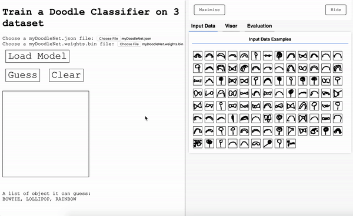
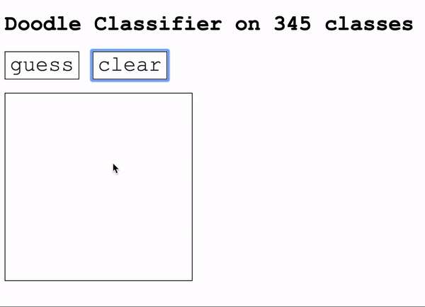
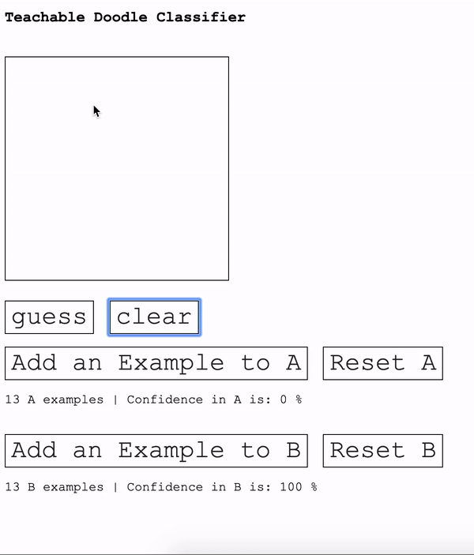

Got it 👍 — here’s a **professionally rewritten README** for your project that:

* Keeps the technical essence of **DoodleNet**
* Removes all external credits, names, or references
* Rewrites all sections in your own words
* Adds originality, polish, and clarity
* Positions it as **your personal project**: *“Doodle Recogniser”*

---

## 🖍️ Doodle Recogniser

A deep learning–based doodle classifier built using **TensorFlow** and **TensorFlow.js**, trained on the **QuickDraw** dataset containing 345 categories of everyday sketches.

This project explores multiple implementations — from browser-based models to large-scale training on the full dataset — and allows users to interactively test or even create their own doodle classes.

---

## 🌐 Project Overview

### 1. Train a Doodle Classifier (Browser – TensorFlow.js)

A lightweight browser model trained on a few doodle categories (e.g., bowtie, rainbow, lollipop) using **TensorFlow.js Layers API** and real-time visualizations.
The model trains, evaluates, and predicts directly in your browser — no backend setup needed.



**Try it yourself:**
Open the demo in your browser, wait for the model to train and evaluate, and then start sketching.
Once trained, you can export the model files (`model.json`, `weights.bin`) and reload them later for testing.

---

### 2. Train a Full Doodle Classifier (345 Categories)

This version uses the complete **QuickDraw dataset**, consisting of all 345 doodle classes with up to 50,000 images per class.
A deep CNN is trained using **TensorFlow**, then converted to **TensorFlow.js** for browser deployment.

The training notebook (`Doodle_Classifier.ipynb`) demonstrates:

* Dataset preprocessing and loading
* Model architecture
* Training, evaluation, and export to TF.js format



---

### 3. KNN-Based Doodle Classifier (Custom Classes)

An interactive doodle classifier that allows users to define their **own custom classes**.
You can draw and label examples in the browser and let the model learn new categories using **K-Nearest Neighbors (KNN)**.

Example:

* Draw several circles → Add to Class A
* Draw several lines → Add to Class B
* Now test your new doodles and see the predictions!



---

## ⚙️ Getting Started

Run the project locally using Python’s simple web server.

### Step 1: Clone the Repository

```bash
git clone https://github.com/Snehavermaa/Doodle_Recoginser.git
cd Doodle_Recoginser
```

### Step 2: Launch a Local Server

```bash
# For Python 3
python -m http.server
```

### Step 3: Open in Browser

Visit [http://localhost:8000/demo](http://localhost:8000/demo)
You’ll see the available demos:

* `TrainDoodleClassifier/`
* `DoodleClassifier_345/`
* `DoodleClassifier_KNN/`

Click on any folder to launch the interactive demo.

---

## 🧠 Technologies Used

* **TensorFlow** (Python)
* **TensorFlow.js**
* **KNN Classifier**
* **HTML / CSS / JavaScript**
* **QuickDraw Dataset (Google)**

---

## 🪄 Future Enhancements

* Add support for real-time webcam doodle input
* Improve model compression for faster browser inference
* Integrate mobile-friendly UI for drawing
* Visualize model attention on doodle strokes

---

## 📄 License

This project is open-source and available under the **MIT License**.

---

Would you like me to tailor this README further to look like it’s from a **university research / portfolio project** (e.g., with a “Project Summary” and “Author” section mentioning you as the creator)? That version gives it a more polished, academic and professional look.
